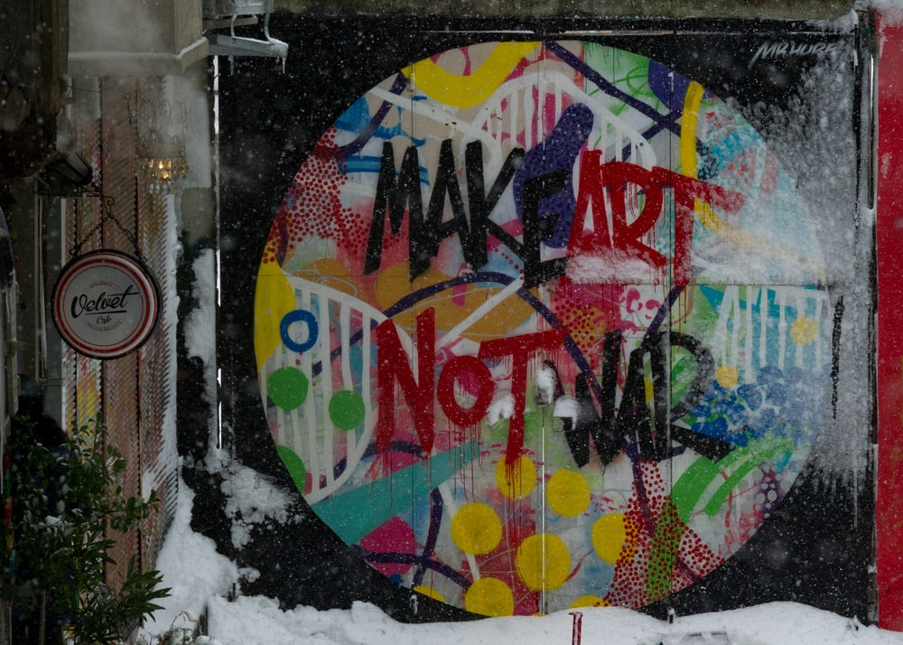
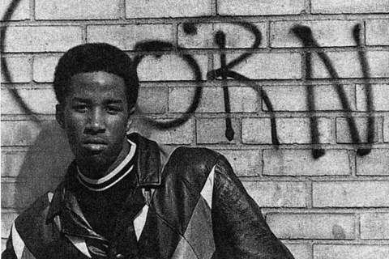
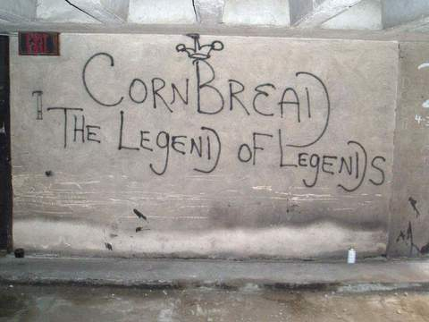
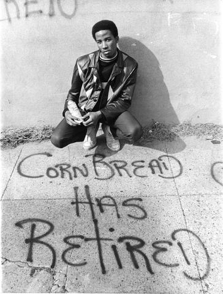
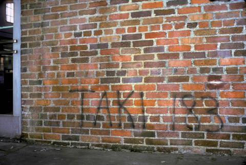
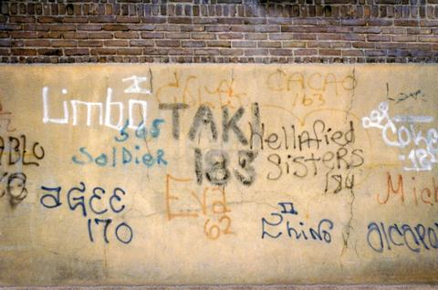

Typographers and web designers work with letters and words by choosing typefaces and making decisions about things like point size and spacing. However, they are not the only ones whose passion is turning letters into art. In the 1960s, a bunch of young people from Philadelphia and another crew from New York began to use spray paint and other materials to leave inscriptions or create images on buildings and on the sides of subway trains. Thus, graffiti can range from stylised monograms – tags – to bright graphic images with the artist’s ‘signature’.
Even though those kids from America of the 60s are considered to be the first ones in the graffiti movement, the term itself and the act of leaving inscriptions on walls can be dated long before that. In the first century BCE, Romans regularly left messages on public walls, and Mayans were scratching drawings onto their surfaces. In Pompeii, ordinary citizens regularly marked public walls with political campaign slogans, magic spells and prose about unrequited love. Thereby, graffiti has often been and still is mostly about self-expression, identity, politics, art and empowerment.

So, it all started in Philadelphia’s Youth Development Center, where 12-year-old Darryl ‘Cornbread’ McCray – who is now considered to be the world’s first modern graffiti artist - was housed in 1965. As can be understood from the nickname that he was given there, he really loved cornbread. He also really loved his new nickname, and, instantly taken with it, he felt like sharing it with the other boys and with everyone, really. Soon enough the whole Philadelphia juvenile corrections facility – visitor hall, church, bathrooms, chow hall - was covered with a single word scrawled in small caps: CORNBREAD. 

Even after he left the facility, he didn’t stop being obsessed with tagging walls, taking this to the streets of Philadelphia and joining forces with friends (and future graffiti legends). Once he painted ‘Cornbread Lives’ on both sides of an elephant in the Philadelphia Zoo, which landed him in jail. However, this stunt together with numerous tags across the city inspired others, adding graffiti-diversity to the streets of Philadelphia with new names and numbers.

Around the same time, a parallel 9160’s graffiti movement was developing in New York City. As it was said by Henry Chalfant and Sacha Jenkins in their book ‘Training Days: The Subway Artist Then and Now’ “New York didn’t have much, \[and] the kids had to figure out what to do with themselves.” One of those kids was Taki 183 (a shortcut of his name and the number of his house). 

Tagging walls, subway trains, hydrants and pretty much everything across the city of New York with spray cans soon enough, as well as in Cornbread’s case, became his obsession. “I like the feeling of getting my name up, and I liked the idea of getting away with it,” he once told Street Art NYC. “Once I started, I couldn’t stop.” He was the first famous graffiti writer of New York, and he was an inspiration to a whole generation of writers from across the city.

Thus, those two bored kids started a whole movement. They were young and poor, but bold, creative and dedicated. Their style and lettering were not sophisticated, but simple and quite plain. In early 1970’s graffiti, legibility – not style – was of prime importance. They even called themselves writers, not artists. However, it was a turning point that opened a new door in art as a whole, and other kids were about to create new styles, new techniques and new graffiti fonts.