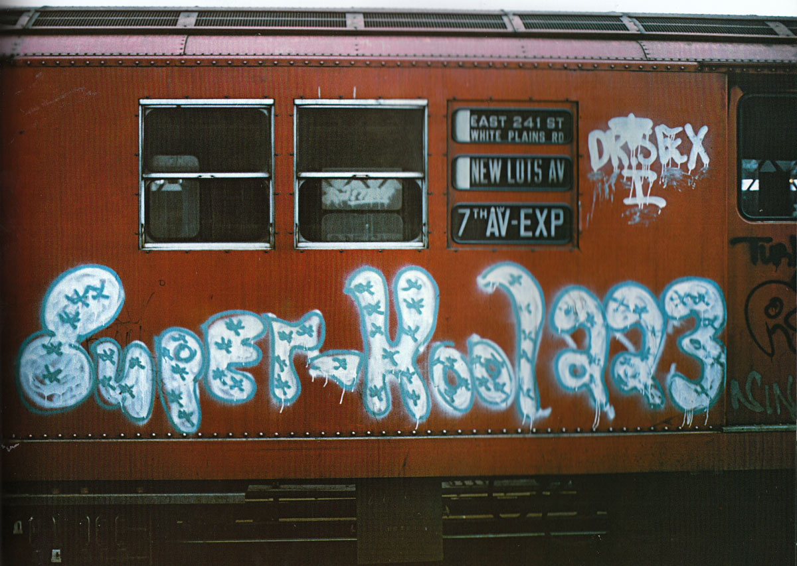
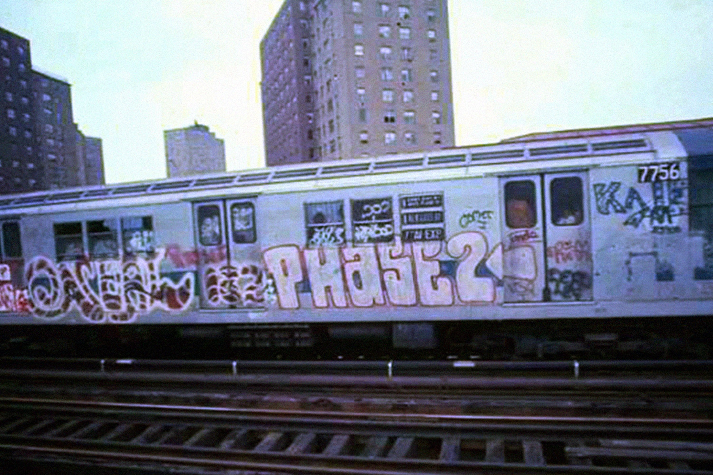

On March 15, 1918 in Moscow, the first issue of the futurist Newspaper was published under the editorship of V. Mayakovsky, D. Burlyuk and V. Kamensky. In his manifesto, Mayakovsky wrote:

“…In the name of the great march of equality for all, as far as culture is concerned, let the Free Word of creative personality be written on the corners of walls, fences, roofs, the streets of our cities and villages, on the backs of automobiles, carriages, streetcars, and on the clothes of all citizens.\
\
Let pictures (colors) be thrown, like colored rainbows, across streets and squares, from house to house, delighting, ennobling the eye (taste) of the passer-by. Artists and writers have the immediate duty to get hold of their pots of paint and, with their masterly brushes, to illuminate, to paint all the sides, foreheads, and chests of cities, railway stations, and the ever-galloping herds of railway carriages.\
\
From now on, let the citizen walking down the street enjoy at every moment the depths of thought of his great contemporaries, let him absorb the flowery gaudiness of this day’s beautiful joy, let him listen to music—the melody, the roar, the buzz—of excellent composers everywhere. Let the streets be a feast of art for all.

And if all this comes to pass, in accordance with our word, everyone who goes out into the street will grow to be a giant and in wisdom, contemplating beauty instead of the present-day streets with their iron books (signboards), where every page has been written on their signs by greed, the lust for mammon, calculated meanness and low obtuseness, all of which soil the soul and offend the eye…”

Back then, of course, it wasn’t about graffiti. It wasn’t about the contemporary definition of street art either. However, even though this decree was published more than a century ago, it perfectly resonates with the so-called ideology of graffiti artists and the graffiti movement itself.

So, In mid-70s, lots of writers followed Cornbread and Taki. They used whatever they could find to spread their tags across the city, painting subway trains at night to ensure their work was seen by the most possible amount of people. “It began in different neighbourhoods. But we all had one thing in common: We wanted to be famous.”

Soon, the Metropolitan Transportation Authority began to whitewash the trains. However, it only intensified the process of stylistic change, and there were many more potential targets, and they were all in some way clean canvases.

As a result, 1970’s graffiti soon progressed from scribbled signatures done with industrial markers to elaborate artworks done with multiple aerosol colours in the dark of night. Writers began to experiment with new lettering styles, and even though it’s hard to call graffiti of 70's art, it was the beginning of this movement's journey there. And that is fascinating.

