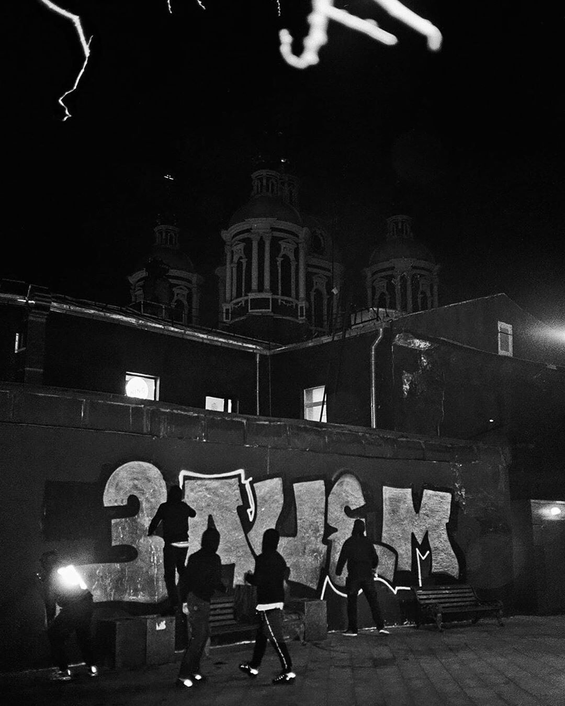
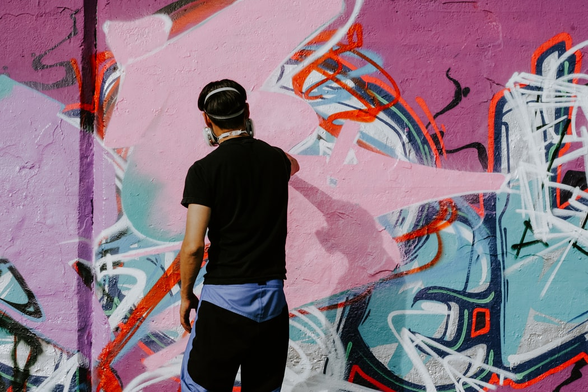

If you just pay attention, you will notice that there are graffiti everywhere. It can be a large, glorious and professionally made mural in a “whole wall of a building” size. Or, it can be just a small hard-to-read inscription on a bus stop made by some bored kid while he was waiting for his transport to come, so he could finally get home, make a quick dinner, go on Netflix and keep filling up his sketchbook with drawings of cartoon characters while watching “BoJack Horseman”. Some would refer the first work to art, saying that the kid’s tag is vandalism. I remember walking with my mom to our favourite coffee-shop, and we passed by this crazy big and pretty tag (don’t know what was written there as it’s usually hard to read graffiti tags, but it still was nice!), surrounded by weirdly drawn smiling fish and dinosaurs who were smoking joints. My mom took a brief glance and said something like: “Oh, why they do it? It’s so ugly.” While I was astonished by how cool it was and how much I loved it. People say lots of things about graffiti-artists and their works: some like it, some don't. However, what do graffiti-artists themselves have to say?

“It still surprises me. You have to say that letters or any text *can* be beautiful (surely, without damaging the commodity of perception) when it actually *has to* be beautiful!”

“You are what you draw. How you draw it. Through shapes, through colour, you can understand a person, you can understand the very essence of the human.”

“When people look at handstyles, they see something that doesn’t exist. They always say that my works are abstract. Well, of course, they are. Even if I start explaining that those are letters, outlines, filling.”

“Graffiti is some kind of egoism. You go on the streets to write your name there, to make a statement about yourself. It’s like an embodiment of yourself through the work. Self-expression. Self-declaration.”

 “Oh, I write anything, really. It’s not about the words. It’s about the letters and the way *I will make them look.*”

“I don’t think it’s selfishness, narcissism. I think that it’s just the work over the shape. It’s just the combination of letters you are working on. Like your own logo, your own mark.”

“Oh, so often you just have no clue what’s written there. It’s all about plasticity, thickness, dynamics of the lines, the letters. You are transmitting your emotional state through that visual language.”

“Yeah, I realise that ordinary people can’t always read them. But whatever. Communication is usually to other writers, not to the general public.”