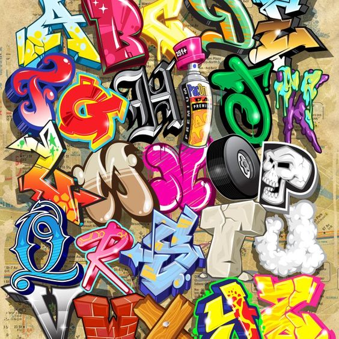

Graffiti fonts have gained a lot of recognition in the world of typography as well as amongst artists and art in general. It’s hard to argue that graffiti fonts are rather unique, with their own sort of urban vibe. Usually vivid, with those embellished colours and outlines, they perfectly suit for catching the attention of readers, viewers, and spectators. Thanks to these eye-catching traits, nowadays one can often notice that graffiti fonts are widely used in advertising campaigns, especially for the younger generation, as it is something that seems to resonate with them. The fonts are also broadly used in cartoons, as the graffiti vibe often kind of complements the cartoons’.

The Internet has led to the development of many things, and graffiti fonts were not an exception. With the accessibility and availability of the Net to average people in the 1990s and later, graffiti took a turn from the streets to the web. Since modern graffiti first burst onto the urban street, the year 2000 saw the biggest evolution of style and technique, all thanks to the connectivity of the web. Graffiti fonts and typefaces began to pop up on more and more sites, changing and developing. The more they spread, the more realization would come on how unique this style was, being great for everything from flyers, product packaging, magazines to t-shirts, caps and books. 

Currently, there is still a great demand for graffiti fonts. Hundreds and hundreds of graffiti-inspired products from various independent creators are being sold on Creative Market. The fonts, in their turn, are incredibly creative works of art that convey vibrancy, evocativeness and great deals of personality and character. So, designers can apply them to a limitless number of projects. Those can be clothing, logos, posters, album covers, brochures, flyers, headers, websites and so on. 

Undoubtedly, graffiti fonts are very outstanding. Take a look at any font family of graffiti, and you will immediately notice how it stands out compared to any other font design and style. Graffiti fonts are brasher and *louder*, stronger and way more colourful. They typically have this element of exaggeration and absurdity: they display surreal outlines and shapes together with vivid colours. Often, this makes them difficult to properly read them, but such fonts are purely artistic and not actually meant to be only about the functional aspect in the first place.