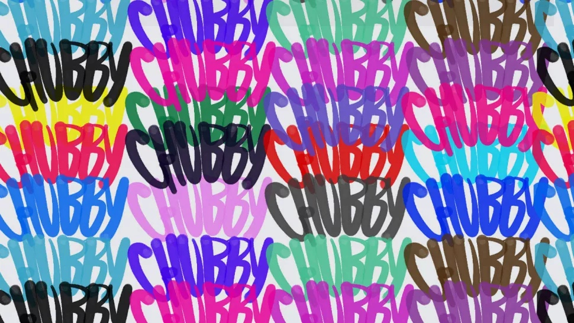
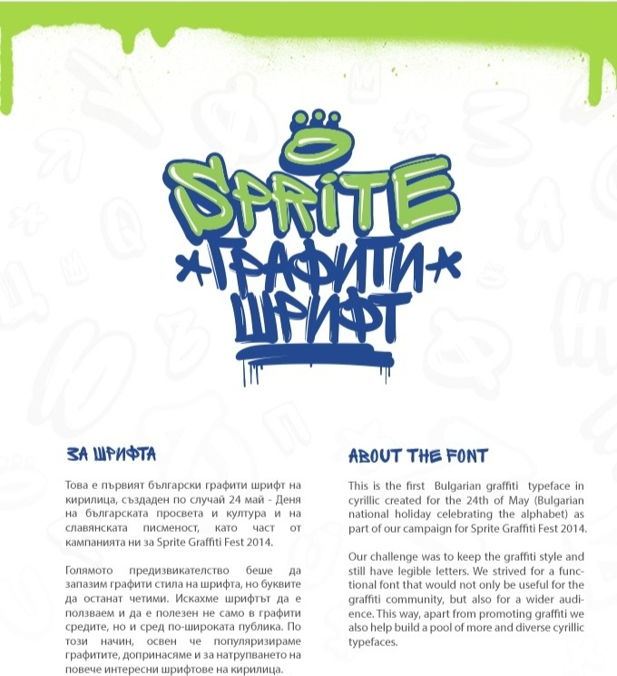
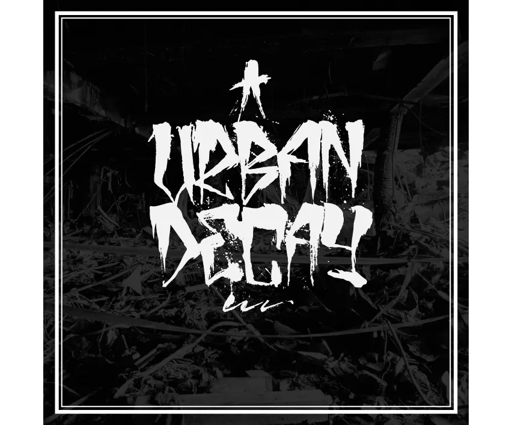
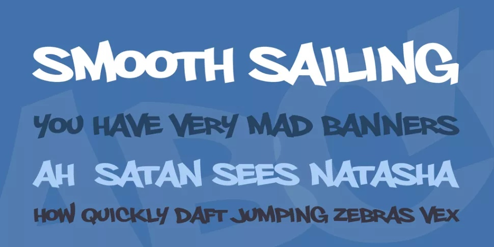
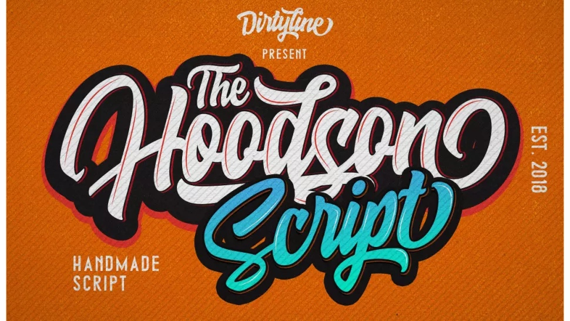
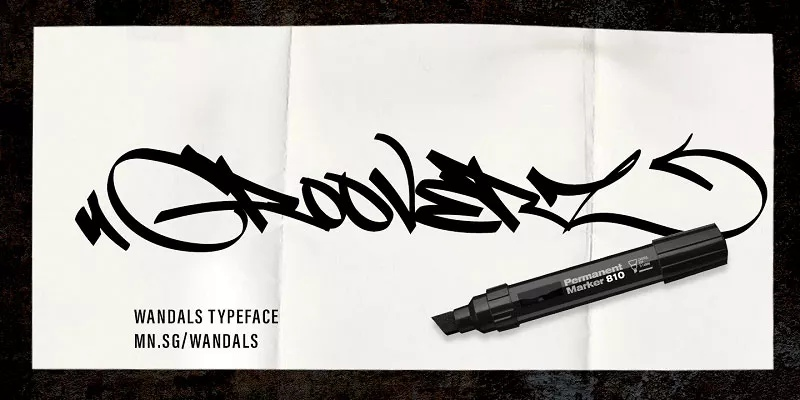
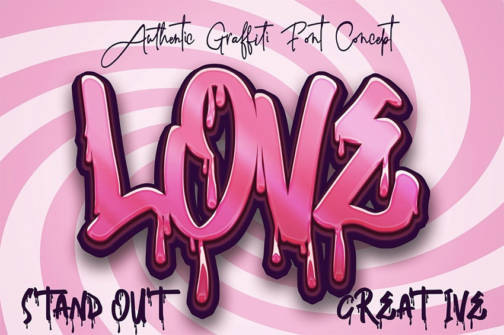
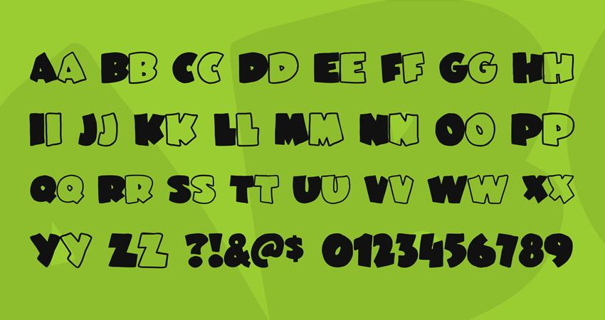

Nowadays, artists and writers no longer have to vandalize locations so the world could see their graffiti art. The web allows them to create gorgeous and exquisite fonts that they can display publicly and legally, whether they decide to sell them or make them available for free.

On the web, there is a variety of different graffiti fonts and you can find so many of them. It is not very easy to find the best graffiti font because it’s pretty tricky to define what makes a graffiti font. But, as everything in this world, some people will like something, some won’t. In this chapter, I’ve collated some examples of free to download graffiti fonts I think are the prettiest and most outstanding.

**01. Rusto Cap Brush**

Rusto Fat Cap Brush is a personal project from designers Luis Di Lascio and Patri Pérez. With a flowing spraypaint style, it's bold and colourful and can be downloaded for free from Dropbox.

**02. Sprite**

Featuring a merging of legibility and graffiti style, this appealing font was created in Cyrillic. This is a functional font, that is totally legible whilst keeping the graffiti feel, in a brushstroke style. Built for a wide audience, it is an approachable way of adding an urban edge to a project.

**03. Urban Decay**

Urban decay is a handmade brush font that creator Zofos made to 'celebrate graffiti, urban exploration, street calligraphy and inner city living.' This font has this rugged authenticity that will bring an urban feel to your projects. 

**04. Philly Sans**

A heavy, lowercase-only font that has a grafitti feel whilst being super clear to read, Philly Sans is certainly versatile. Made by Philatype, it is a great typeface for display and is totally free for personal use.

**05. Hoodson Script**

Created by Hendra Dirtyline (Dirtyline Studio), Hoodson Script's features are a bouncy baseline and a perfectly paired complimentary marker font. This retro-style graffiti font comes with handy bonus swashes. 

**06. Fat Wandals** 

Fat Wandals, created by Mans Greback, is a free, personal use-only version of his Wandals font family. It's a great-looking script font with lovely flowing strokes that look like they've been done with a chisel-tip marker, and it comes with a full set of characters with loads of variants and all the punctuation you'll need.

**07.  Skater Boys Dope Graffiti**

A wonderfully handcrafted font with a melting text effect, this font is ideal for crafting, branding, and decorating a project. 

**08. JuneBug Font**

The JuneBug is a playful, graffiti-style font that is perfect for any design project geared towards a young audience. The font includes uppercase and lowercase letters, numbers, and punctuation.

