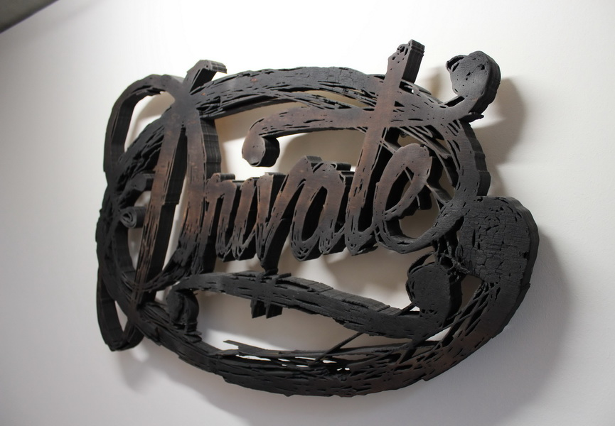

As you might have learnt already from my previous pieces of texts, some graffiti artists just call themselves ‘writers’ as they believe that they are more into writing than creating art. However, there are many recognised artists who use graffiti letters to create text art. Some of them are:

\
**Max Rippon.** 

This American artist creates intelligent street art of typography which evokes America of the 1950s juxtaposed with modern social commentary and all that with a splash of sarcasm and humour. During his early age and after graduating from art school he experimented with different forms of urban art trying to find his style and in recent years his work has become primarily text-based, communicating through the use of various hand-painted elements like graffiti art letters, calligraphy and typography. Later on, he started working with canvas, paper, sculpture and other different found materials. 

\
**L’Atlas.**

Jules Dedet Grenel – or L’Atlas – is a former student of archaeology and calligraphy. This artist is a master of rectangular shaped calligraphy and geometrical forms. Through his works, L’Atlas invents both languages of words and signs by combining influences from Arabic calligraphy and modern tags. With this combination, the character of his works becomes something like a pastiche of graffiti, ancient typography, eastern spiritualism and Greek mythology. 

\
**Alexis Rero.**

\
This conceptual artist’s style is made of his innovative approach to street art based around language. Introduced to the street through graffiti, he eventually felt limited by a spray can and began exploring imagery through the use of typography and design of graffiti art letters. Rero is most noted for his minimalist statements, ironic and dystopian phrases, with a signature stark black line crossing them out used to trigger contemplative reactions from viewers. Apart from exhibiting his work in galleries and abandoned and dilapidated spaces of urban landscapes Alexis Rero also erects his three-dimensional word sculptures made of wood in the natural environments of beautiful open fields and countryside.

A lot of artists used graffiti in their artworks. Another very impressive artwork was made by a French artist **Mathieu Tremblin**. He replaces graffiti that he just saw on the streets with typographic translations. 

Tremblin used stencils to convert each scrawled graffiti into legible typography. He applied the same typeface for each collection of tags and tried to keep the original positioning. 

"It shows the analogy between the physical tag and the virtual tag, both in form and in substance," said the artist. "Like keywords, which are markers of net surfing, graffiti are markers of urban drifting."

