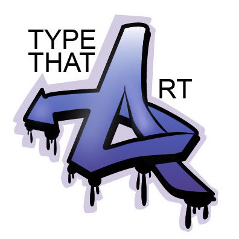
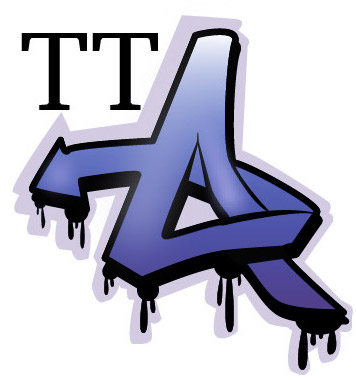
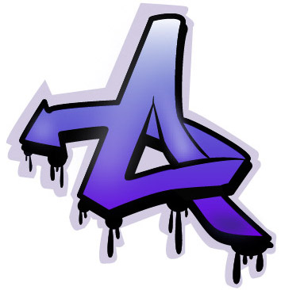

**Hello! And welcome to my blog.** 

My name is Val, and I am a second year student doing Media, Journalism and Publishing at Oxford Brookes University. This blog was a part of my assignment for the module 'Typographic Design for Page and Screen'. The topic that I've chosen is 'Art and typography'. I really love writing and everything that is related to it, and I also really love art. For me, it is fascinating to explore how deeply typography can affect art. It was amazing to find out that there are so many artworks where typography is the key link that helps in analysing those artworks and understand their meaning. I hope that for you it's going to be interesting to see and read all about it. 

**Logo**

I've created my logo in Adobe Illustrator. I was just playing around with the name of the website that I've chosen. So everything is written in a simple non-serif font except just a letter *'A'* in the word *'Art'*. I've tried to make it in graffiti-style, as quite a few of my blog posts are going to be about graffiti. 

However, it didn't really look good with full words typed in the logo when I uploaded, so I decided to use a simplified abbreviation which you can find below. I had to change the non-serif font, as I felt that the combination of letters 'TT' following one another looks better in a serif font. 

**Favicon**

I've also created a favicon for the website, taking just the graffiti-styled 'A' for it, as I didn't want it to be too rammed, leaving it pretty but simple. 

**Images**

The banner image I've found on the website *unsplash,* where one can find a variety of free images that can be used for things like blogs and websites. I was thinking to create a banner image myself, but I believe that using photos of actual artworks for the website about art is better than trying to recreate something that could (doubt that) be called art. As for other imagery in my blog, I also use pictures from unsplash, as well as some pictures that I took myself and my friends' (some of them are really good photographers or artists) pictures that they don't mind me using in here. 

Well, that's pretty much it. Make yourselves comfortable and enjoy the journey into typographic art!